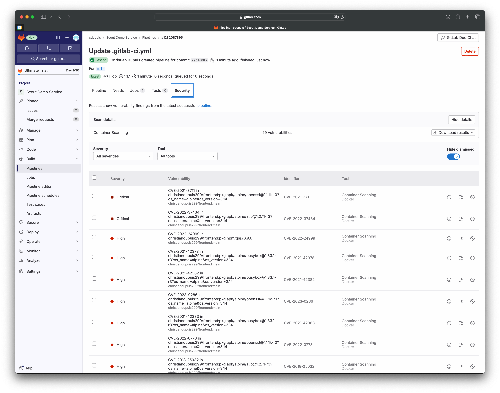

The following examples show how to run Docker Scout in GitLab CI, in a
repository containing the image's Dockerfile and build context.

## Image analysis on push

This example runs a Docker-in-Docker workflow triggered by a commit. The
pipeline runs the following high-level steps:

- Sets up and installs the Docker Scout CLI plugin
- Builds the image
- Runs Docker Scout

The following snippet shows the setup part of the workflow:

1. The first `docker login` command authenticates to the GitLab container registry, using pre-defined environment variables for the repository.
2. The multi-line script installs `curl` and uses it to fetch the Docker Scout CLI plugin, and performs a cleanup.
3. The third and last step uses `docker login` again to authenticate to Docker, which is necessary to run the Docker Scout analysis.

```yaml {title=".gitlab-ci.yml",linenos=true}
docker-build:
  image: docker:latest
  stage: build
  services:
    - docker:dind
  rules:
    - if: $CI_COMMIT_BRANCH
      exists:
        - Dockerfile
  before_script:
    - docker login -u "$CI_REGISTRY_USER" -p "$CI_REGISTRY_PASSWORD" $CI_REGISTRY

    # Install curl and the Docker Scout CLI
    - |
      apk add --update curl
      curl -sSfL https://raw.githubusercontent.com/docker/scout-cli/main/install.sh | sh -s -- 
      apk del curl 
      rm -rf /var/cache/apk/*

    # Sign in to Docker Hub (required for Docker Scout)
    - docker login -u "$DOCKER_HUB_USER" -p "$DOCKER_HUB_PAT"
```

The next snippet builds the image, and then checks if the current workflow is
running on the default branch of the repository:

- If the commit was to the default branch, it uses Docker Scout to get a CVE report.
- If the commit was to a different branch, it uses Docker Scout to compare the new version to the `latest` tag.

```yaml {title=".gitlab-ci.yml",linenos=true,linenostart=23}
  script:
    # Get the relevant tag for the current branch
    - |
      if [[ "$CI_COMMIT_BRANCH" == "$CI_DEFAULT_BRANCH" ]]; then
        tag=""
        echo "Running on default branch '$CI_DEFAULT_BRANCH': tag = 'latest'"
      else
        tag=":$CI_COMMIT_REF_SLUG"
        echo "Running on branch '$CI_COMMIT_BRANCH': tag = $tag"
      fi
  
    # Pull the image
    - docker build --pull -t "$CI_REGISTRY_IMAGE${tag}" .
  
    # Run Docker Scout
    - |
      if [[ "$CI_COMMIT_BRANCH" == "$CI_DEFAULT_BRANCH" ]]; then
        # Get a CVE report for the built image and fail the pipeline when critical or high CVEs are detected
        docker scout cves "$CI_REGISTRY_IMAGE${tag}" --exit-code --only-severity critical,high    
      else
        # Compare image from branch with latest image from the default branch and fail if new critical or high CVEs are detected
        docker scout compare "$CI_REGISTRY_IMAGE${tag}" --to "$CI_REGISTRY_IMAGE:latest" --exit-code --only-severity critical,high --ignore-unchanged
      fi
  
    # Push the image to GitLab container registry
    - docker push "$CI_REGISTRY_IMAGE${tag}"
```

This creates the flow outlined previously. If the commit was to the default
branch, Docker Scout generates a CVE report. If the commit was to a different
branch, Docker Scout compares the new version to the current published version.
It only shows critical or high-severity vulnerabilities and ignores
vulnerabilities that haven't changed since the last analysis.

## Security scanner integration

Docker Scout supports the GitLab container scanning file format, which lets you
use Docker Scout to analyze source code and generate a security reports for
merge requests, visible in the GitLab user interface.



To generate these reports with Docker Scout, use the `--format gitlab` flag for
the `docker scout cves` command, and export it to a file using the
`artifacts:reports:container_scanning` keyword in the GitLab YAML
configuration. Here's a minimal example:

```yaml {title=".gitlab-ci.yml"}
docker-build:
  image: docker:latest
  stage: build
  services:
    - docker:dind
  variables:
    DOCKER_IMAGE_NAME: $CI_REGISTRY_IMAGE:$CI_COMMIT_REF_SLUG
  rules:
    - if: $CI_COMMIT_BRANCH
      exists:
        - Dockerfile
  before_script:
    # Install curl and the Docker Scout CLI
    - |
      apk add --update curl
      curl -sSfL https://raw.githubusercontent.com/docker/scout-cli/main/install.sh | sh -s --
      apk del curl
      rm -rf /var/cache/apk/*

    # Sign in to Docker Hub (required for Docker Scout)
    - docker login -u "$DOCKER_HUB_USER" -p "$DOCKER_HUB_PAT"
  script:
    - docker build --pull -t "$DOCKER_IMAGE_NAME" .
    - docker scout cves "$DOCKER_IMAGE_NAME" --format gitlab --output gl-container-scanning-report.json
  artifacts:
    reports:
      container_scanning: gl-container-scanning-report.json
```
